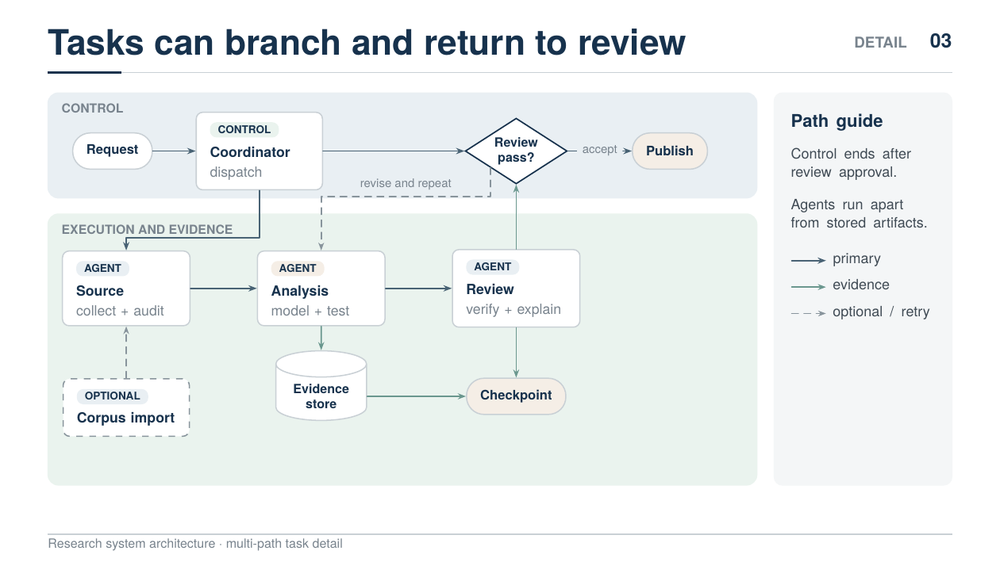
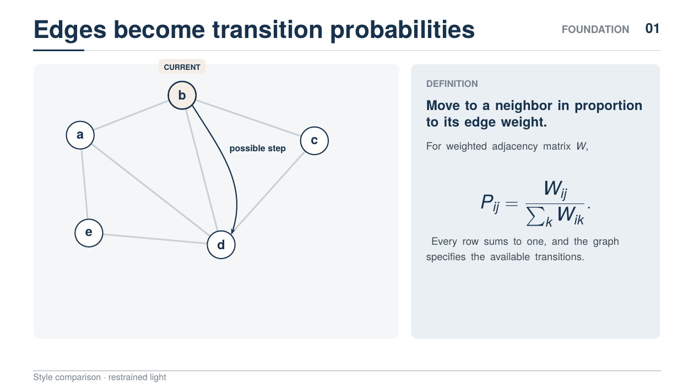
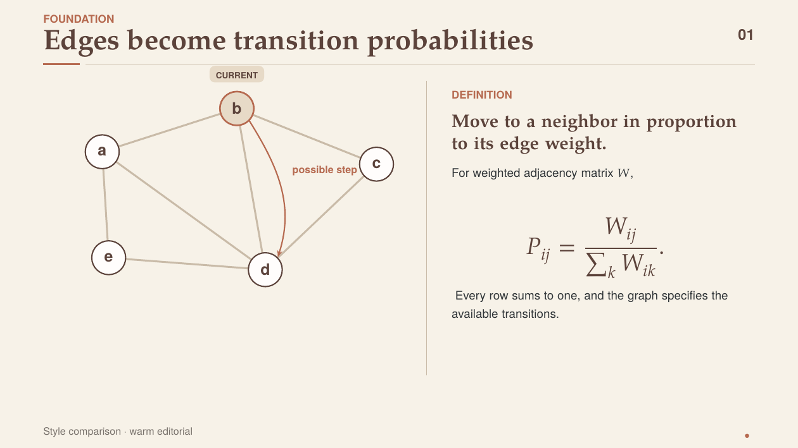
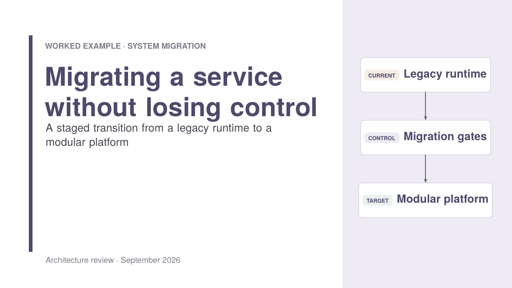
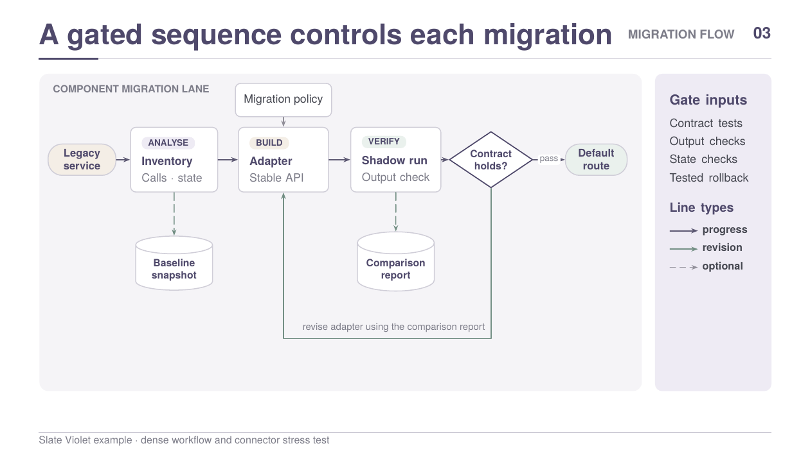
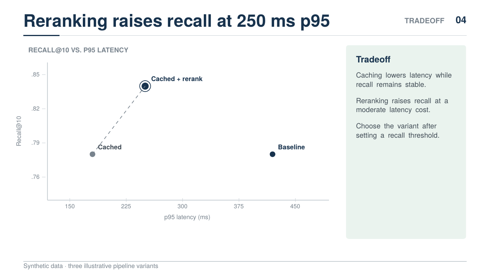
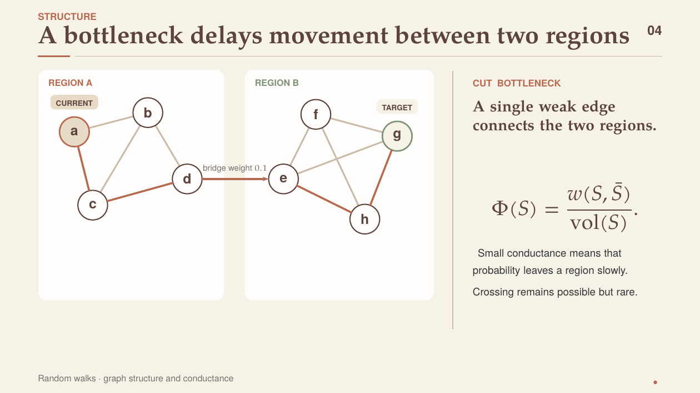

<h1 align="center">Build Beamer Slides</h1>

<p align="center">
  <a href="README.md">English</a> |
  <strong>简体中文</strong>
</p>

<p align="center">
  <strong>设计、渲染并检查 Beamer 幻灯片，再交付人工审阅。</strong>
</p>

<p align="center">
  <a href="SKILL.md">
    
  </a>
  <a href="https://www.latex-project.org/">
    
  </a>
  
  
  
</p>

<p align="center">
  <a href="#示例">示例</a>
  &middot;
  <a href="#skill-提供的内容">功能</a>
  &middot;
  <a href="#安装">安装</a>
  &middot;
  <a href="#审查流程">审查</a>
  &middot;
  <a href="SKILL.md">Skill 参考文档</a>
</p>

`build-beamer-slides` 是一个用于设计、实现、渲染和检查 Beamer 幻灯片的 Codex Skill。它既可以制作整套幻灯片，也可以处理其中若干页，或与用户逐页讨论和修改。

主题、叙述顺序和内容重点由用户决定。该 Skill 负责单页结构、Beamer 实现、图形几何、编译、截图检查，并在人工内容审阅前修复基础视觉问题。

## 示例

### 技术系统与工作流程

系统架构示例包含分组子系统、带标签的卡片、决策节点、产物、可选输入和外部修订路径。



[源码](examples/research-system-architecture/deck.tex) | [PDF](examples/research-system-architecture/deck.pdf)

### 三种内置风格

| Restrained Light | Warm Editorial |
| --- | --- |
|  |  |

| Slate Violet 封面 | Slate Violet 工作流 |
| --- | --- |
|  |  |

第一组页面使用相同的图和转移规则，对比 Restrained Light 与 Warm Editorial 两种风格。Slate Violet 使用另一套技术主题配色，并展示密度更高的工作流。

### 实验结果与数学图形

| 实验结果对比 | 瓶颈图结构 |
| --- | --- |
|  |  |

实验数值是用于排版演示的合成数据。数学示例包括图、矩阵、定义和直接标注的曲线。

## Skill 提供的内容

- 默认的 Restrained Light 风格，以及两种可选内置风格；
- 可复用的 Beamer 模板、TikZ 组件和完整示例源码；
- 标题、正文、卡片、流程图、公式、表格和图表的排版规则；
- 连接端口、布线路径、分组边界和边标签的明确规范；
- 英文、中文和中英混排的幻灯片文字规范；
- 编译、渲染、检查和修复流程，以及针对复杂几何的 400 至 600 dpi 局部截图；
- 由用户决定是否启用独立 Reviewer subagent，在接受额外时间和 token 开销时获得更严格的审查；
- 两轮编译、LaTeX 日志检查、页面渲染和全部示例验证脚本。

## 安装

将仓库直接克隆到 Codex 的 Skill 目录：

```bash
mkdir -p "${CODEX_HOME:-$HOME/.codex}/skills"
git clone https://github.com/xukp20/build-beamer-slides.git \
  "${CODEX_HOME:-$HOME/.codex}/skills/build-beamer-slides"
```

安装后重新加载 Codex，使其发现该 Skill。需要更新时，在克隆目录中运行 `git pull --ff-only`。

## 使用

可以直接指定 Skill：

> 使用 `$build-beamer-slides` 根据这些笔记制作五页技术汇报。采用默认浅色风格，并提供可编辑源码和 PDF。

也可以修改已有幻灯片或只修复单页：

> 使用 `$build-beamer-slides` 修改这套 Beamer 幻灯片的第 4 至 6 页。保留现有风格，并检查每一张修改过的页面。

> 使用 `$build-beamer-slides` 修复这张工作流页面。以高分辨率检查每条连线、容器边界和多行标签。

自定义请求可以提供参考幻灯片、截图、品牌色、字体、Logo 或项目模板。采用自定义风格时，仍需遵守可读性要求并完成渲染检查。

## 内置风格

| 风格 | 适用内容 | 起始模板 |
| --- | --- | --- |
| [Restrained Light](styles/light/STYLE.md) | 默认技术和研究汇报 | [模板](styles/light/template-169.tex) |
| [Warm Editorial](styles/warm-editorial/STYLE.md) | 偏暖色的数学讲解和学术报告 | [模板](styles/warm-editorial/template-169.tex) |
| [Slate Violet Light](styles/slate-violet/STYLE.md) | 需要独立浅色技术主题的架构、迁移和计划汇报 | [模板](styles/slate-violet/template-169.tex) |

[自定义风格配置](references/custom-style.md)说明了如何建立单套幻灯片专用风格，或将风格整理成可复用资源包。

## 审查流程

开始制作前，Skill 会请用户选择 `仅制作者自查` 或 `制作者自查 + 独立 Reviewer`。两种模式都要求制作者完成全部自查步骤。

每张修改过的页面都采用相同的制作与自查流程：

1. 明确页面的主要信息，并选择合适的视觉形式。
2. 精简文字，为容器和图形分配明确的几何空间。
3. 编译两次，检查相关 LaTeX 错误和 overfull box。
4. 以 200 dpi 渲染所有修改页，检查完整页面。
5. 以 400 至 600 dpi 检查复杂连接点、折线、标签、覆盖层、分组入口和最外侧节点。
6. 修改源码，重新编译，并复查受影响的位置。
7. 基础排版检查通过后，才可准备交付或提交独立 Reviewer。

启用独立审查时，单独的只读 Reviewer 会检查当前 PDF、范围内的所有整页截图和必要的高分辨率局部截图。Reviewer 将问题反馈给制作者，由制作者修改并重新渲染，再交给同一个 Reviewer 复查。该流程持续到 Reviewer 返回 `PASS`，或提出必须由用户决定的问题。关闭独立审查时，制作者完成第 7 步后即可交付。

审查内容包括文字边距、自然换行、卡片内边距、标题和分隔线间距、连线端点、箭头方向、折线路径、图表标签、公式一致性，以及文字与图形是否表达同一内容。

详细规范：

- [页面审查清单](references/page-audit-checklist.md)
- [渲染与审查流程](references/review-loop.md)
- [独立 Reviewer 流程](references/reviewer-workflow.md)
- [图形设计](references/diagram-design.md)
- [幻灯片文字](references/slide-text.md)

## 构建与验证工具

标准渲染脚本需要 XeLaTeX、`pdfinfo` 和 `pdftoppm`：

```bash
scripts/render_and_check.sh examples/research-system-architecture/deck.tex /tmp/architecture-render
```

脚本会编译两次、检查日志，并以 200 dpi 渲染指定页面。完成脚本运行后仍需实际检查截图。

可以使用以下命令生成复杂区域的高分辨率局部截图：

```bash
scripts/render_pdf_crop.sh \
  examples/research-system-architecture/deck.pdf \
  3 /tmp/review/control 600 144 324 2736 672
```

编译并渲染全部内置示例：

```bash
scripts/validate_examples.sh /tmp/beamer-example-review
```

内置风格使用 XeLaTeX 可用字体。自定义风格应单独说明额外的字体或素材依赖。

## 完整示例源码

| 示例 | 内容 | 源码 | PDF |
| --- | --- | --- | --- |
| Research system architecture | 系统总览、复杂工作流、职责划分与恢复 | [TeX](examples/research-system-architecture/deck.tex) | [PDF](examples/research-system-architecture/deck.pdf) |
| Experimental results review | 指标卡片、矩阵、柱状图、散点图与局限 | [TeX](examples/experimental-results-review/deck.tex) | [PDF](examples/experimental-results-review/deck.pdf) |
| Random walks on graphs | 定义、图状态、矩阵、瓶颈与收敛 | [TeX](examples/random-walks-on-graphs/deck.tex) | [PDF](examples/random-walks-on-graphs/deck.pdf) |
| Software system migration | 封面、分层架构、带 gate 的流程、风险矩阵与路线图 | [TeX](examples/software-system-migration/deck.tex) | [PDF](examples/software-system-migration/deck.pdf) |
| 同内容风格对比 | 使用 Restrained Light 和 Warm Editorial 呈现同一张图 | [Light](examples/style-comparison/light.tex) / [Warm](examples/style-comparison/warm.tex) | [Light](examples/style-comparison/light.pdf) / [Warm](examples/style-comparison/warm.pdf) |

这些示例是经过测试的设计参考，不是固定的叙述模板。修改文字或几何布局后，应重新执行完整的视觉检查。

## 仓库结构

```text
.
├── README.md
├── README.zh-CN.md
├── SKILL.md
├── agents/
├── references/
├── scripts/
├── styles/
│   ├── light/
│   ├── warm-editorial/
│   └── slate-violet/
├── examples/
│   ├── research-system-architecture/
│   ├── experimental-results-review/
│   ├── random-walks-on-graphs/
│   ├── software-system-migration/
│   └── style-comparison/
├── gallery/
└── reviews/
```

## 许可证

MIT。详见 [LICENSE](LICENSE)。
